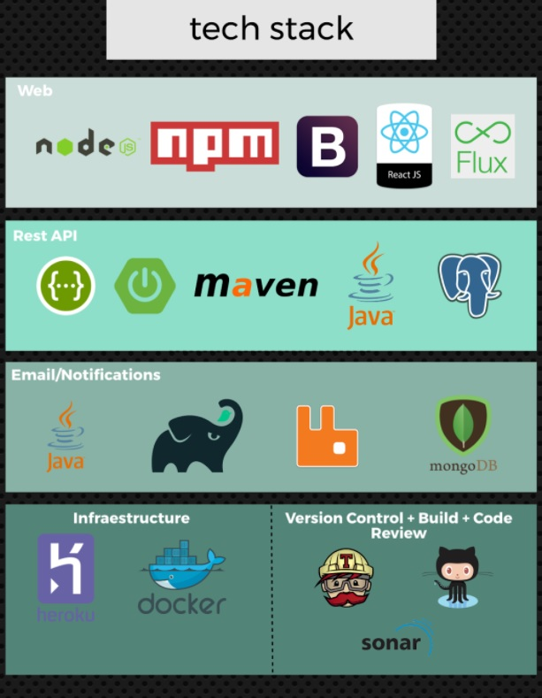
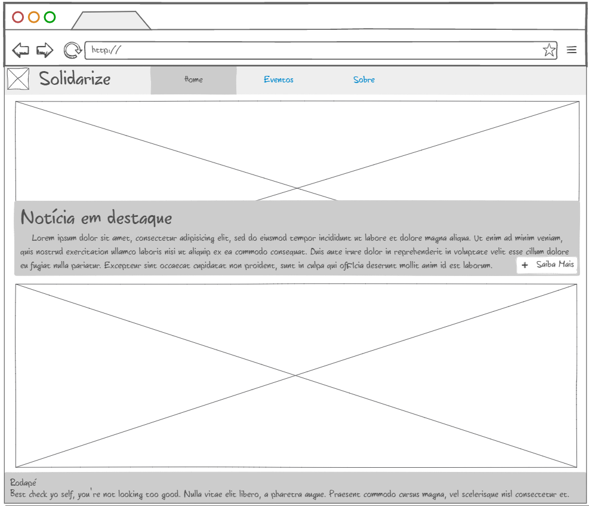
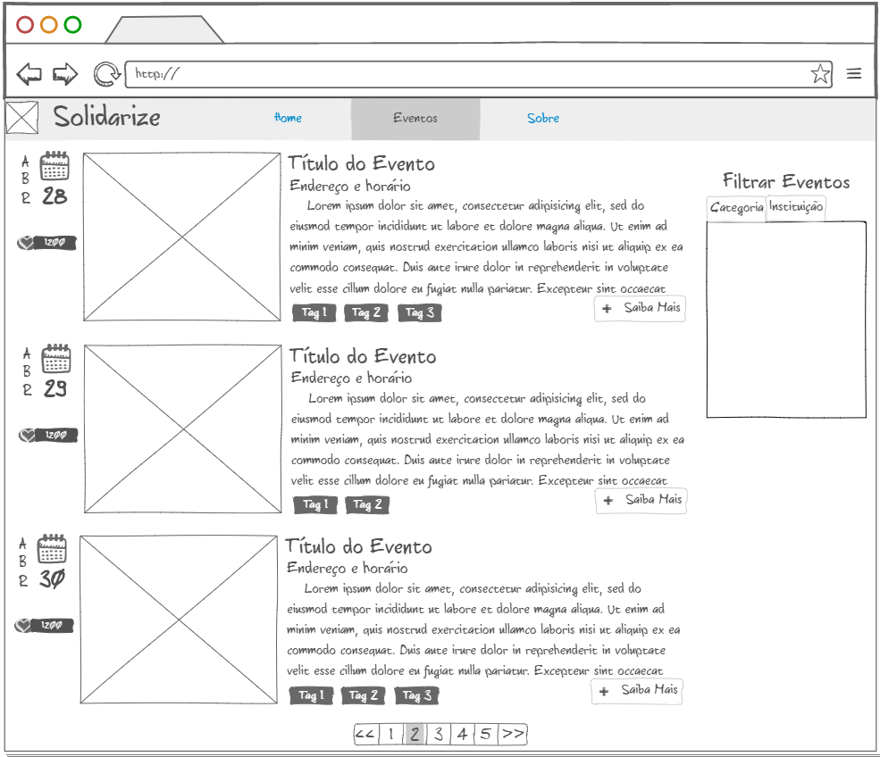
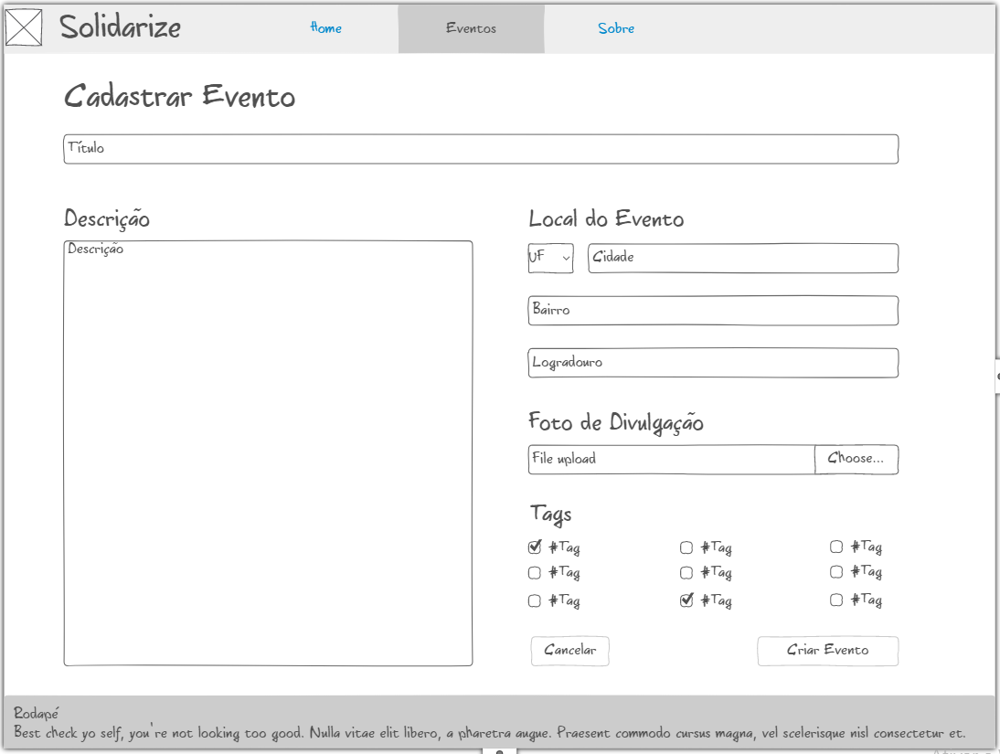
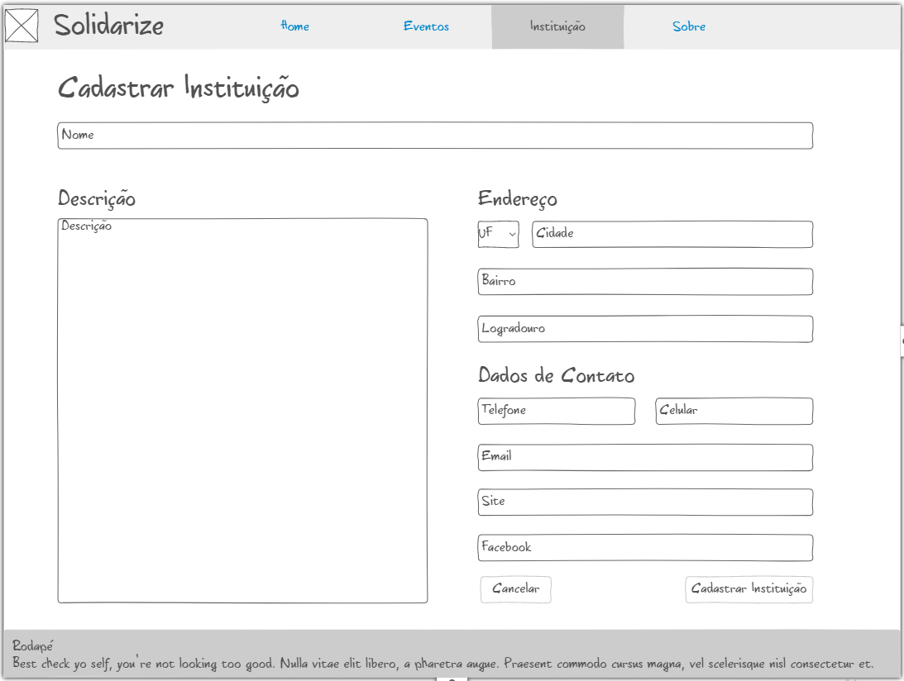
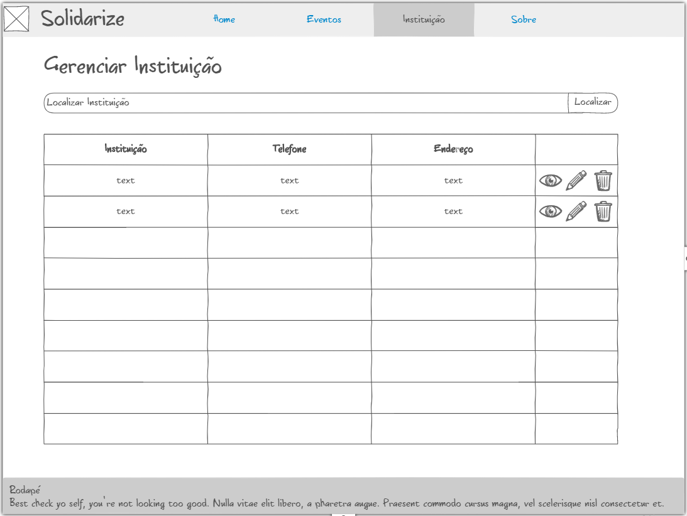

# Solidarize

### Tech Stack:

___

[Heroku Link](http://solidarize-dev.herokuapp.com/)

[Travis Link](https://travis-ci.org/Solidarize/Solidarize)

[Sonar Link](https://sonarcloud.io/component_measures?id=com.solidarize)

___

# Mockups:
### Index:

### Eventos:

### Detalhes do Evento:

### Cadastro de Evento:

### Cadastro de Instituição:

### Gerenciar Instituição:

