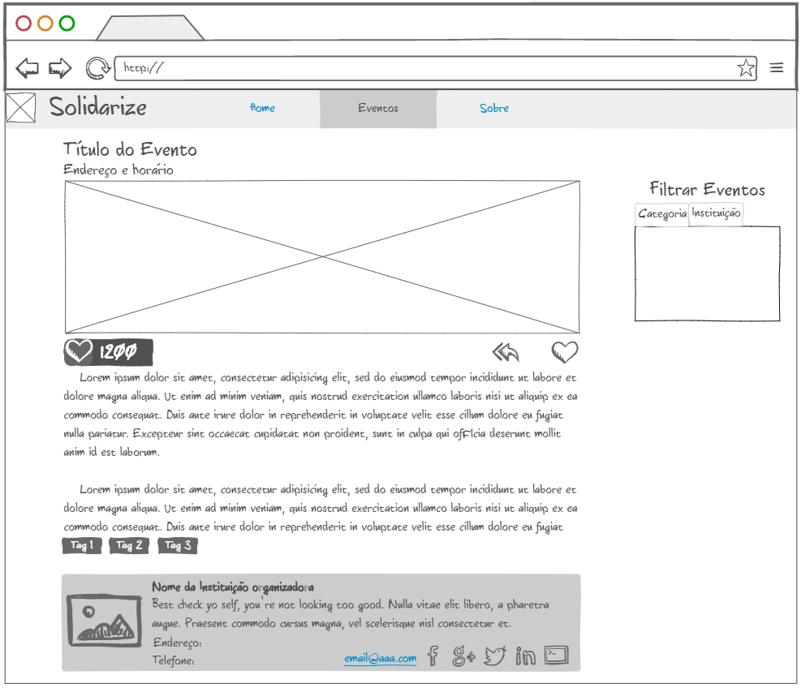

# Solidarize

### Tech Stack:

___

[Heroku Link](http://solidarize-dev.herokuapp.com/)

[Travis Link](https://travis-ci.org/willmenn/Solidarize)

___

# Mockups:
### Index:

### Eventos:

### Detalhes do Evento:

### Cadastro de Evento:

### Cadastro de Instituição:

### Cadastro de Instituição:

### Cadastro de Instituição:

